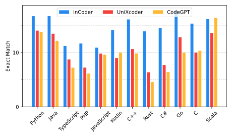
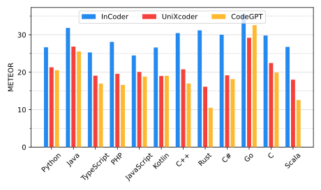
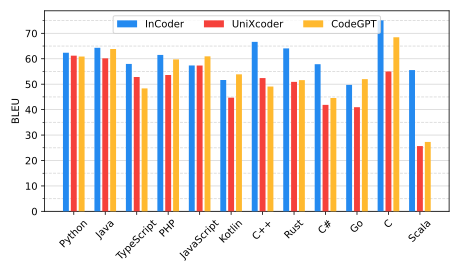
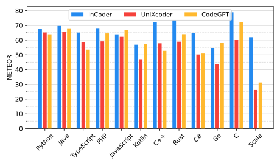

# Online Plots

This page shows all plots related to online evaluation.
Use the following menu to navigate to the plots:
- [Metric Explanation](#metric-explanation-)
- [Performance per Language](#performance-per-language-)
  - [Acceptance Rate](#acceptance-rate-) 
  - [Exact Match](#exact-match-)
  - [Edit Similarity](#edit-similarity-)
  - [BLEU-4](#bleu-4-)
  - [METEOR](#meteor-)
  - [ROUGE-L](#rouge-l-)
- [Performance per Language (Accepted Completions)](#performance-per-language-accepted-completions-)
  - [Exact Match](#exact-match--1)
  - [Edit Similarity](#edit-similarity--1)
  - [BLEU-4](#bleu-4--1)
  - [METEOR](#meteor--1)
  - [ROUGE-L](#rouge-l--1)
- [Performance per Trigger Point](#performance-per-trigger-point-)
  - [Exact Match](#exact-match--2)
  - [Edit Similarity](#edit-similarity--2)
  - [BLEU-4](#bleu-4--2)
  - [METEOR](#meteor--2)
  - [ROUGE-L](#rouge-l--2)

## Metric Explanation [↑](#metric-explanation-)

#### Exact Match
The Exact Match metric assesses whether a prediction and its ground truth align perfectly, disregarding any leading or trailing whitespace. This yields a binary result, which is then expressed as a percentage.

#### Edit Similarity
The Edit Similarity calculates the number of character edits required for the ground truth to be an exact match of the prediction.
It also introduces three techniques used for editing: insertion, deletion, and replacement.
A penalty of 1 for wrong characters, too many characters, and too few characters, respectively.
The similarity score is calculated by dividing the Levenshtein Distance by the length of the longest candidate.
This results in a number between 0 and 1.

#### BLEU4
BLEU4, a variant of BLEU (BiLingual Evaluation Understudy), is an automated method first proposed to assess machine translation. 
BLEU4 compares the tokenized established facts with predictions, deriving a weighted sum of 1 to 4 N-grams with equal weights assigned to each N-gram. However, this metric fails if N-grams of every size are not present, an issue that often arises given that completions typically span only one line. To avoid this, we use  smoothing methods.
Chen et al. proposed and evaluated seven smoothing techniques to more accurately represent human judgment[^smooth] from which we use method 2 as it has been found to offer a better representation of the similarity between predictions and actual data by Shi et al.[^shi2022evaluation] and used in the literature[^lu2021codexglue][^wang2021codet5].

[^smooth]: B. Chen and C. Cherry, "A Systematic Comparison of Smoothing Techniques for Sentence-Level BLEU".
[^shi2022evaluation]: E. Shi et al., "On the Evaluation of Neural Code Summarization".
[^lu2021codexglue]: S. Lu et al., "CodeXGLUE: A Machine Learning Benchmark Dataset for Code Understanding and Generation"
[^wang2021codet5]: Y. Wang, W. Wang, S. Joty, and S. C. Hoi, "CodeT5: Identifier-aware Unified Pre-trained Encoder-Decoder Models for Code Understanding and Generation"

#### METEOR
The METEOR (Metric for Evaluation of Translation with Explicit ORdering) score employs both precision and recall to evaluate the alignment of unigrams in the ground truth and prediction. Precision signifies the unigrams in the prediction that also appear in the ground truth, while recall represents the unigrams in the ground truth that are present in the prediction. METEOR grants a tenfold weight on precision compared to recall. Banerjee et al.[^Banerjee2005] argue that METEOR more accurately emulates human judgment than BLEU and Lavie et al.[^lavie2004significance] demonstrated that recall is more akin to human judgment than precision.

[^Banerjee2005]: S. Banerjee and A. Lavie, "METEOR: An Automatic Metric for MT Evaluation with Improved Correlation with Human Judgments".
[^lavie2004significance]: A. Lavie, K. Sagae, and S. Jayaraman, "The significance of recall in automatic metrics for MT evaluation".

#### ROUGE-L
ROUGE-L is a variant of ROUGE (Recall-Oriented Understudy for Gisting Evaluation)[^Lin2004] which compares the tokenized ground truth with the prediction, evaluating it based on the longest common sub-sequence wherein each code token operates as a uni-gram. ROUGE-L calculates and employs both precision and recall to determine an F1 score.

[^Lin2004]: C.-Y. Lin, "ROUGE: A Package for Automatic Evaluation of Summaries".

#### Acceptance Rate
Acceptance Rate is the proportion of the number of completions accepted by a user 
to the number of completions presented to them.

## Performance per Language [↑](#performance-per-language-)
### Acceptance Rate [↑](#acceptance-rate-)

### Exact Match [↑](#exact-match-)

### Edit Similarity [↑](#edit-similarity-)

### BLEU-4 [↑](#bleu-4-)

### METEOR [↑](#meteor-)

### ROUGE-L [↑](#rouge-l-)

## Performance per Language (Accepted Completions) [↑](#performance-per-language-accepted-completions-)
This section considers the performance per language when only considering
completions that were accepted by the user.
Despite higher scores compared to the previous setting (where we consider *all* predictions), 
the results indicate that modifications are still necessary to meet developers' expectations.

### Exact Match [↑](#exact-match--1)

### Edit Similarity [↑](#edit-similarity--1)

### BLEU-4 [↑](#bleu-4--1)

### METEOR [↑](#meteor--1)

### ROUGE-L [↑](#rouge-l--1)

## Performance per Trigger Point [↑](#performance-per-trigger-point-)
### Exact Match [↑](#exact-match--2)

### Edit Similarity [↑](#edit-similarity--2)

### BLEU-4 [↑](#bleu-4--2)

### METEOR [↑](#meteor--2)

### ROUGE-L [↑](#rouge-l--2)

