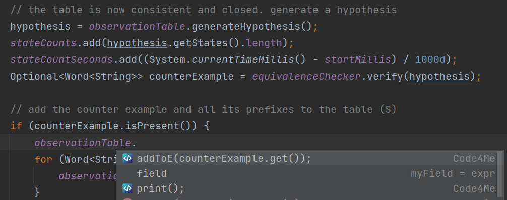
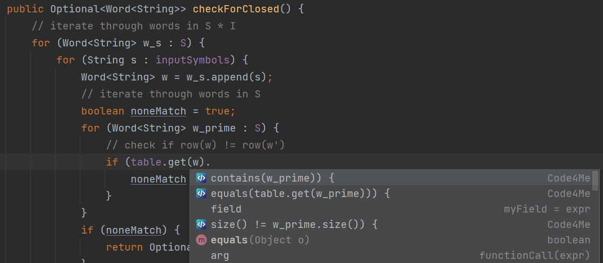

# Replication Package

This repository is a replication package for "_Language Models for Code Completion: A Practical Evaluation_"

#### Online Evaluation
Online evaluation tests the three selected LMs on their code completion performance in a real-world setting.
We created IDE extensions for JetBrains IDEs and Visual Studio Code, allowing users to use the three
models, giving us data on their performance in practice.

The `online` directory contains the script we use for the evaluation of our IDE extension data, and plots for all metrics. The user data required to run the evaluation script is not public as our users were ensured their data would be kept private.

#### Offline Evaluation
Offline evaluation tests three selected LMs for code on their code completion performance
using synthetic test sets created from the [Unseen dataset](https://github.com/VHellendoorn/Code-LMs#evaluation).
In our work we show that creating test sets from datasets may not accurately represent model performance in practice.

The `offline` directory contains all the code necessary to reproduce our offline evaluation, along with plots for all metrics and our outputs.

## Ethics
We have Ethics Review Board (ERB) approval from our institution's ethics board to conduct the
qualitative analysis on development context in our online evaluation setting.

## Online and Offline Evaluation Plots
The following links are provided for quick access to all plots for our online and offline evaluation.
Plots for **all metrics** are present, even those not present in the paper.

### [View Online Evaluation Plots](./ONLINE_PLOTS.md)
### [View Offline Evaluation Plots](./OFFLINE_PLOTS.md)

All plots can be viewed individually in the `offline/plots` and `online/plots` directories.

## Trigger Points
The trigger points that we use, and the number of datapoints we have per individual trigger point can be found in the following page: 

### [View Trigger Points](./TRIGGER_POINTS.md)

## Code4Me Examples

### Example 1

### Example 2

### Example 3

## Coding Data
The coding data, labels per file, model, usage scenario, trigger point, and programming language can be found here:

### [View Coding Data](./coding_data.csv)

## Taxonomy of potential causes for poor performance

| ID     | Label                           | Frequency | Description                                                                    |
|--------|---------------------------------|-----------|--------------------------------------------------------------------------------|
| **ME** | **Model-oriented Errors**       | **5511**  | **Errors that are attributed to the models' behavior.**                        |
| ME-T   | Token Level                     | 3835      | The model makes an error on a token level.                                     |
| ME-T1  | Incorrect variable              | 1435      | The model made an error predicting a variable name.                            |
| ME-T2  | Incorrect function              | 1162      | The model made an error predicting the name of a function.                     |
| ME-T3  | Incorrect literal               | 1130      | The model made an error when predicting a string, numbers, etc..               |
| ME-T4  | Incorrect type                  | 108       | The model made an error predicting a type.                                     |
| ME-S   | Statement Level                 | 1676      | The model makes an error on a statement level.                                 |
| ME-S1  | Wrong parameter count           | 613       | The model predicted the wrong number of parameters used in a statement.        |
| ME-S2  | Wrong semantics                 | 352       | The model predicts the wrong statement type.                                   |
| ME-S   | Untimely termination            | 318       | Ill-timed termination of a prediction.                                         |
| ME-S3  | Early termination               | 205       | The model stops predicting before the statement is complete.                   |
| ME-S4  | Late termination                | 113       | The model continues predicting after it should have terminated.                |
| ME-S   | Rambled Outputs                 | 249       | The model generates nonsensical outputs until the termination token.           |
| ME-S5  | Looped repetition               | 171       | The model goes into an infinite loop of predicting the same (few) tokens.      |
| ME-S6  | Copied input context            | 78        | The model incorrectly copied a segment from the left or right context.         |
| ME-S7  | Faulty syntax                   | 144       | The model's prediction contains a syntax error.                                |
| **AE** | **Application-oriented Errors** | **2030**  | **Errors that can be attributed to how the model was applied in practice.**    |
| AE-1   | Mid-token invocation            | 1173      | The model was called in the middle of an identifier or operator.               |
| AE-2   | Insufficient context            | 482       | The file did not contain enough context for the model to correctly predict.    |
| AE-3   | Redundant invocation            | 240       | There was no need to call the model at that location.                          |
| AE-4   | Typographical errors in input   | 135       | The context used for the model contained misspellings or incorrect syntax.     |
| **UO** | **User-overridden Outputs**     | **771**   | **Situations where developers overrode models' predictions.**                  |
| UO-1   | Correct but not accepted        | 605       | The prediction matched the ground truth however the user did not accept it.    |
| UO-2   | Valid but not preferred         | 112       | The prediction was valid however the user did not accept it.                   |
| UO-3   | Accepted but required change    | 54        | The user-approved prediction needed alteration to align with the ground truth. |
